# Whisper · Explorador Encoder/Decoder

**Proyecto Final — Procesamiento de Datos Secuenciales**
Maestría en Inteligencia Artificial y Ciencias de Datos · Universidad Autónoma de Occidente

**Integrantes:**
- Mónica Giraldo
- Andrés Hernández
- Armando Betancourt
- Mario Ramírez

---

## 1. Resumen (Abstract)

Este proyecto aplica **Whisper**, una arquitectura Transformer encoder–decoder desarrollada por OpenAI, al reconocimiento automático del habla (transcripción) y a la traducción de voz hacia el inglés. No se entrenó ningún modelo: se usaron los pesos preentrenados publicados por los autores y se implementó el proceso de inferencia paso a paso, separando explícitamente el preprocesamiento del audio, el encoder, la decodificación autoregresiva y la atención cruzada.

Como escenario de aplicación se construyó un chat que permite enviar mensajes de voz y obtenerlos como texto, ya sea transcritos en su idioma original o traducidos al inglés. La solución es una aplicación en Streamlit con dos modos. El **Asistente** es ese chat: el usuario conversa, envía o graba un audio y recibe la transcripción o la traducción. El **Explorador** muestra lo que ocurre dentro del modelo: el espectrograma Mel de entrada, las representaciones del encoder, la probabilidad con que el decoder eligió cada token y un mapa de atención cruzada que indica qué parte del audio consultó el modelo para generar cada palabra.

En las pruebas con el modelo base en CPU, la aplicación transcribió y tradujo correctamente mensajes de voz cortos en español, con tiempos de procesamiento menores que la duración del audio (RTF entre 0,19 y 0,75). En el Explorador, la frase "¿Dónde está Felipe?" se transcribió con una log-probabilidad media de −0,25, y el mapa de atención cruzada permitió observar la relación entre los tokens generados y distintas regiones temporales del audio durante la inferencia.

---

## 2. Introducción

### Artículo base

- **Artículo:** A. Radford, J. W. Kim, T. Xu, G. Brockman, C. McLeavey e I. Sutskever, *Robust Speech Recognition via Large-Scale Weak Supervision*, 2022. [arXiv:2212.04356](https://arxiv.org/abs/2212.04356)
- **Repositorio original:** [github.com/openai/whisper](https://github.com/openai/whisper)

### Contexto del problema

El reconocimiento del habla consiste en convertir una señal de audio, que es una secuencia continua de muestras, en una secuencia discreta de palabras. Es un problema de secuencia a secuencia con dos dificultades: las dos secuencias tienen longitudes muy distintas (30 segundos de audio son 480 000 muestras, pero pueden ser solo unas 80 palabras) y no existe una correspondencia fija entre un instante del audio y una palabra.

Los sistemas tradicionales se entrenaban con conjuntos de datos pequeños y muy curados, y fallaban al cambiar de micrófono, acento o nivel de ruido. Whisper aborda el problema entrenando con una cantidad masiva de audio de internet y su transcripción, aunque esas etiquetas no sean perfectas.

### Motivación

El problema encaja con el objetivo del curso: es una secuencia compleja de lenguaje, la arquitectura es un Transformer encoder–decoder clásico y la atención cruzada tiene una interpretación visual muy clara, porque muestra cómo el texto se alinea con el audio.

### Escenario de aplicación

Como caso de uso se planteó un **asistente conversacional tipo chat** que recibe mensajes de voz y los convierte en texto. El usuario conversa con el asistente, le indica qué necesita y le envía el audio, ya sea grabándolo con el micrófono o adjuntando un archivo. El asistente ofrece dos servicios:

- **Transcripción:** convierte el audio en texto en el mismo idioma en que se habló. Por ejemplo, un audio en español se convierte en texto en español.
- **Traducción:** convierte el audio en texto traducido al inglés. Por ejemplo, un audio en español se convierte en texto en inglés.

El asistente identifica la tarea a partir de lo que el usuario escribe (por ejemplo, "quiero traducir este audio") o de los botones de la interfaz. Si recibe un audio antes de saber qué hacer con él, pregunta si debe transcribirlo o traducirlo. Una vez elegida la tarea, la mantiene para los audios siguientes hasta que el usuario pida cambiarla.

El escenario muestra en la práctica la innovación multitarea de Whisper: el mismo modelo, con los mismos pesos, resuelve las dos tareas. Lo único que cambia es el token de tarea (`<|transcribe|>` o `<|translate|>`) que se le entrega al decoder al inicio de la secuencia.

### Objetivo

Implementar la inferencia de Whisper con pesos preentrenados, explicar en detalle su arquitectura y su mecanismo de atención (incluida la generación de Q, K y V) y construir una interfaz interactiva que permita cargar audio y observar el comportamiento interno del modelo.

---

## 3. Marco teórico

### 3.1 Arquitectura general

Whisper es un Transformer encoder–decoder en el que la entrada es audio y la salida es texto.

```
Audio (16 kHz)
   │
   ▼
Espectrograma log-Mel (80 × 3000)        ← 30 s, un frame cada 10 ms
   │
   ▼
2 convoluciones 1D + GELU (stride 2)     ← 3000 frames → 1500 posiciones
   │
   ▼
+ Codificación posicional sinusoidal
   │
   ▼
ENCODER: N bloques [Self-Attention → MLP]
   │
   ▼
Representación del audio (1500 × d_model)  ──────────┐
                                                     │ K, V
Tokens especiales + tokens ya generados              │
   │                                                 │
   ▼                                                 │
Embedding + codificación posicional aprendida        │
   │                                                 │
   ▼                                                 │
DECODER: N bloques [Masked Self-Attention → Cross-Attention → MLP]
   │
   ▼
Capa lineal (pesos compartidos con el embedding) → Softmax → siguiente token
```

Cada bloque usa conexiones residuales y normalización por capa aplicada **antes** de cada subcapa (*pre-norm*), lo que estabiliza el entrenamiento de redes profundas.

El proyecto trabaja con el modelo **base** de Whisper, que tiene estas dimensiones:

| Modelo | Capas (encoder / decoder) | d_model | Cabezas | d_k por cabeza | Parámetros |
|---|---|---|---|---|---|
| base | 6 / 6 | 512 | 8 | 64 | 74 M |

### 3.2 Entradas y salidas

**Entrada del encoder.** El audio se remuestrea a 16 kHz, se recorta o se rellena con silencio hasta 30 segundos y se convierte en un espectrograma log-Mel de 80 bandas, calculado con ventanas de 25 ms cada 10 ms. El resultado es una matriz de 80 × 3000. Dos convoluciones 1D reducen el eje temporal a la mitad, de modo que el encoder trabaja con 1500 posiciones, cada una equivalente a 20 ms de audio.

**Entrada del decoder.** Una secuencia de tokens especiales que le indican al modelo qué hacer, seguida de los tokens ya generados:

```
<|startoftranscript|> <|es|> <|transcribe|> <|notimestamps|>  …tokens generados…
```

**Salida.** En cada paso, el decoder produce un vector de probabilidades sobre las 51 865 subpalabras del vocabulario. Se elige el token más probable, se agrega a la entrada y se repite hasta generar `<|endoftext|>`.

### 3.3 Mecanismo de atención

Todas las capas de atención de Whisper calculan:

$$\text{Attention}(Q,K,V) = \text{softmax}\left(\frac{QK^\top}{\sqrt{d_k}}\right)V$$

- **QKᵀ** compara lo que busca cada posición (Q) con lo que ofrece cada una de las otras (K). El resultado es una tabla de puntajes.
- **÷ √d_k** evita que los puntajes crezcan con la dimensión; sin esta división, el softmax se satura y los gradientes se anulan.
- **Softmax** convierte cada fila en porcentajes que suman 1: los pesos de atención.
- **× V** mezcla la información de las posiciones según esos pesos.

Whisper usa tres tipos de atención:

| Atención | Dónde | Q viene de | K y V vienen de | Máscara |
|---|---|---|---|---|
| Self-attention | Encoder | Audio | Audio | No: el audio está completo |
| Masked self-attention | Decoder | Tokens | Tokens anteriores | Sí: no puede ver tokens futuros |
| Cross-attention | Decoder | Tokens (decoder) | Salida del encoder | No |

### 3.4 Cómo se generan Q, K y V

En cada capa de atención, Q, K y V se obtienen con tres proyecciones lineales aprendidas:

$$Q = X_q W_Q + b_Q, \qquad K = X_{kv} W_K, \qquad V = X_{kv} W_V + b_V$$

En el modelo base, cada matriz W tiene tamaño 512 × 512. Un detalle propio de la implementación de Whisper es que la proyección de K **no tiene bias**.

- En la **self-attention**, X_q y X_kv son la misma secuencia.
- En la **cross-attention**, X_q es el estado del decoder y X_kv es la salida del encoder. K y V se calculan una sola vez a partir del audio, mientras que Q cambia con cada token generado.

Luego, Q, K y V se dividen en h cabezas. En el modelo base hay 8 cabezas de 512 / 8 = 64 dimensiones cada una. Cada cabeza calcula su propia atención, los resultados se concatenan y una proyección lineal de salida los combina.

### 3.5 Innovaciones

1. **Supervisión débil a gran escala.** El modelo se entrenó con 680 000 horas de audio de internet con transcripciones no verificadas manualmente, en lugar de conjuntos pequeños y curados. Esto lo hace robusto a acentos, ruido y distintos micrófonos sin necesidad de reentrenarlo para cada dominio.
2. **Formato multitarea con tokens especiales.** Un solo modelo transcribe, traduce al inglés, detecta el idioma y, opcionalmente, predice marcas de tiempo. La tarea se indica con tokens al inicio de la secuencia del decoder; no hacen falta modelos ni cabezas de salida distintos.
3. **Multilingüe por diseño.** El mismo modelo maneja 99 idiomas con un vocabulario de subpalabras compartido.
4. **Arquitectura estándar, sin ajustes especiales.** Los autores usaron deliberadamente un Transformer encoder–decoder casi sin modificaciones. La mejora proviene de los datos y del formato multitarea, no de cambios en la arquitectura.
5. **Funciona sin ajuste fino (*zero-shot*).** Se evalúa directamente en conjuntos de prueba que no vio durante el entrenamiento.

---

## 4. Metodología

### Proceso de implementación

1. Selección del artículo y verificación de que el código y los pesos preentrenados estuvieran disponibles.
2. Estudio de la arquitectura en el artículo y en el código fuente de `whisper/model.py`.
3. Implementación manual de la inferencia: en lugar de usar únicamente la función `transcribe()`, se separaron el preprocesamiento, el encoder, el bucle de decodificación y la extracción de la atención cruzada.
4. Construcción de la interfaz en Streamlit con los modos Asistente y Explorador.
5. Pruebas con audios propios y medición de métricas.

### Herramientas

| Herramienta | Uso |
|---|---|
| Python 3.11 / 3.12 | Lenguaje principal |
| PyTorch | Ejecución del modelo |
| openai-whisper | Arquitectura, pesos y tokenizador |
| Streamlit | Interfaz interactiva |
| Matplotlib, pandas | Visualizaciones y tablas |
| imageio-ffmpeg | Decodificación de audio sin instalar ffmpeg en el sistema |

### Uso de pesos preentrenados

No se entrenó ni se ajustó el modelo. Los pesos oficiales se descargan automáticamente la primera vez que se llama a `whisper.load_model()` y quedan en la caché local. Todo el trabajo se centra en la inferencia y en la interpretación de lo que ocurre dentro del modelo.

---

## 5. Desarrollo e implementación

### Estructura del repositorio

```
├── app_whisper_streamlit.py   # Aplicación (Asistente + Explorador)
├── requirements.txt           # Dependencias
├── INSTRUCCIONES.md           # Guía detallada de instalación
├── README.md
└── capturas/                  # Capturas del código, de la interfaz y de las pruebas
```

### Pasos para ejecutar

```bash
python -m venv .venv
# Windows:      .\.venv\Scripts\Activate.ps1
# macOS/Linux:  source .venv/bin/activate
python -m pip install -r requirements.txt
python -m streamlit run app_whisper_streamlit.py
```

La aplicación se abre en `http://localhost:8501`. La guía completa, con la solución de errores frecuentes, está en [`INSTRUCCIONES.md`](INSTRUCCIONES.md).

### Carga de pesos

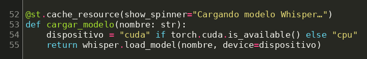

*Líneas 52–55 de `app_whisper_streamlit.py`.* `whisper.load_model` descarga el archivo de pesos oficial (unos 140 MB para el modelo base) y construye la red. `st.cache_resource` evita recargarlo cada vez que se interactúa con la interfaz. La aplicación usa la GPU automáticamente si está disponible.

### Preprocesamiento

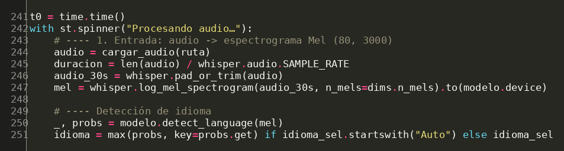

*Líneas 241–251.* El audio se carga en mono a 16 kHz, `pad_or_trim` lo deja exactamente en 30 s (480 000 muestras) y `log_mel_spectrogram` lo convierte en la matriz de 80 × 3000 que recibe el encoder. Con esa misma matriz, `detect_language` calcula la probabilidad de cada idioma: el decoder recibe solo `<|startoftranscript|>` y se comparan las probabilidades de los tokens de idioma.

### Inferencia paso a paso (modo Explorador)

**1. Encoder.** Se ejecuta una sola vez por audio y convierte el espectrograma en 1500 vectores de 512 dimensiones, cada uno equivalente a 20 ms de audio:

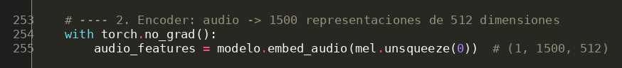

**2. Decoder autoregresivo (greedy, temperatura 0).** El decoder arranca con la secuencia de tokens especiales (inicio, idioma, tarea y sin marcas de tiempo). En cada vuelta recibe toda la secuencia actual junto con la salida del encoder, se toman las probabilidades del último token, se bloquean los tokens de marcas de tiempo, se elige el más probable y se agrega a la secuencia. Se detiene al generar `<|endoftext|>`. En cada paso también se guardan la probabilidad del token elegido y la de la segunda mejor opción, que alimentan la gráfica de confianza:

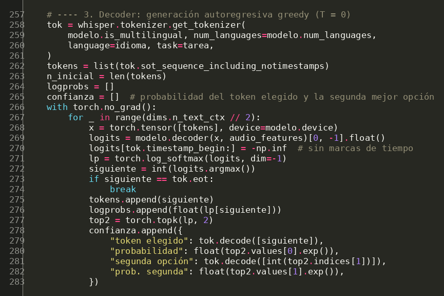

**3. Extracción de la atención cruzada.** PyTorch usa por defecto SDPA, una implementación optimizada de la atención que no devuelve la matriz de pesos. Por eso, al inicio del programa se desactiva:

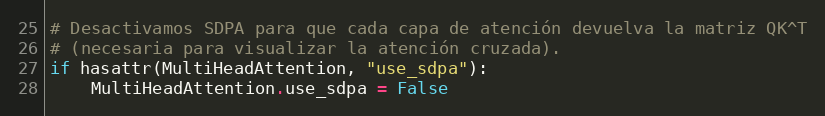

Luego se registra un *hook* en la capa `cross_attn` de cada bloque del decoder. Al pasar una vez más la secuencia completa, cada hook captura la matriz QKᵀ de su capa; después se retiran los hooks:

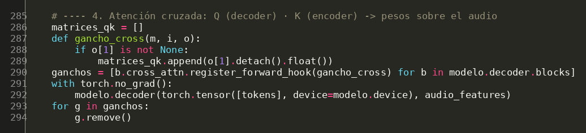

**4. Visualización de la atención cruzada.** A las matrices capturadas se les aplica softmax y se promedian las cabezas y la mitad superior de las capas. Se toma la fila de la consulta que predijo cada token, se recorta al tramo de audio real (20 ms por posición del encoder) y se dibuja como mapa de calor, con los tokens en el eje vertical y el tiempo del audio en el horizontal:

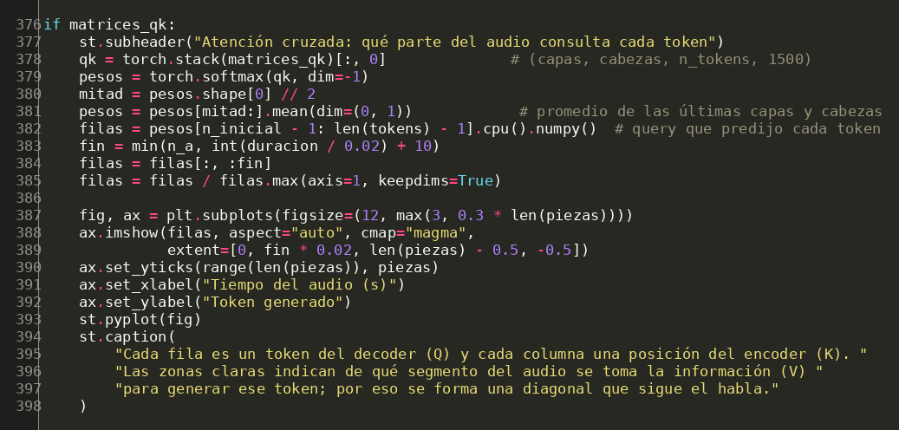

### Flujo del chat (modo Asistente)

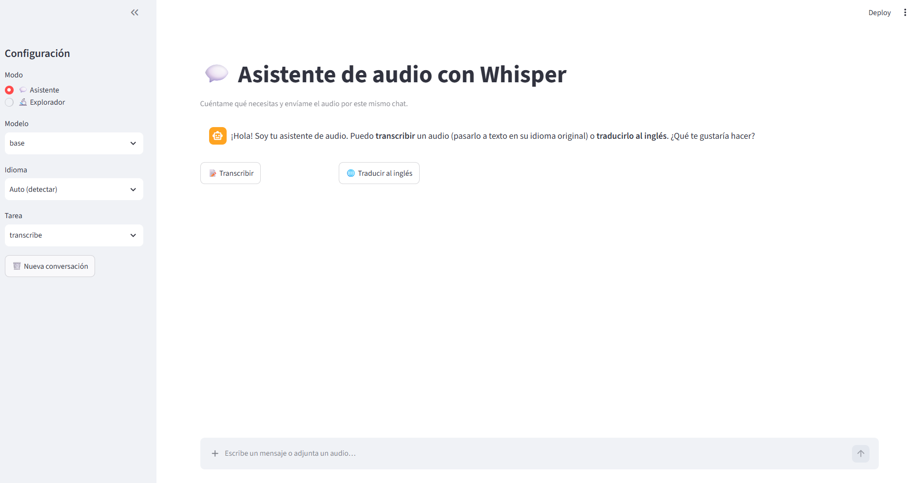

*Pantalla inicial del chat: el asistente saluda y ofrece las dos tareas. En la barra lateral se elige el modo y el modelo (base).*

1. El asistente saluda y ofrece las dos tareas: transcribir o traducir al inglés.
2. El usuario elige la tarea escribiéndola en el chat o con los botones. La intención se detecta por palabras clave: por ejemplo, "traduc", "inglés" o "english" activan la traducción, y "transcrib", "texto" o "dictado" activan la transcripción.
3. El usuario envía el audio grabándolo con el micrófono o adjuntándolo con el clip de la barra de mensajes (formatos wav, mp3, m4a, flac, ogg y webm).
4. La aplicación llama a `modelo.transcribe(audio, task=tarea)`, donde `tarea` es `"transcribe"` o `"translate"`.
5. El asistente responde con el texto, el idioma detectado, la duración del audio y el tiempo de procesamiento, y queda listo para recibir otro audio con la misma tarea.

La detección de la intención y el procesamiento del audio en el chat se implementan así:

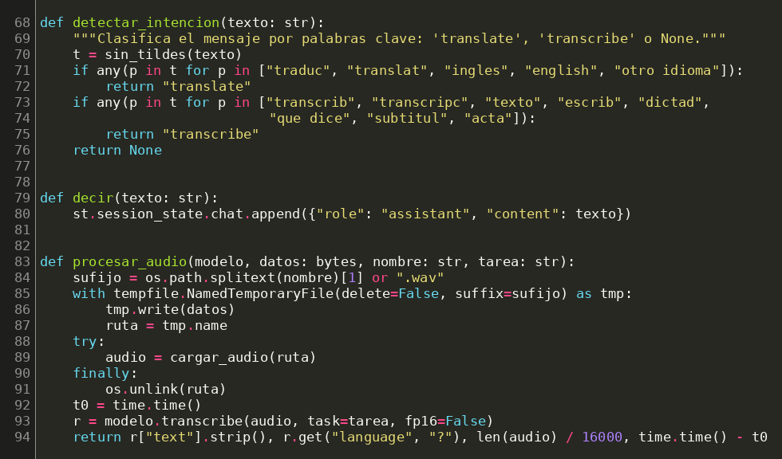

A diferencia del Explorador, el Asistente usa la función completa `transcribe()` de Whisper, que divide los audios largos en ventanas de 30 s. Por eso puede procesar mensajes de voz de cualquier duración.

### Visualizaciones del Explorador

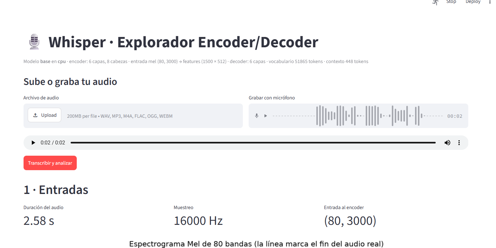

*Parte superior del Explorador: el encabezado resume la arquitectura del modelo cargado (6 capas y 8 cabezas en el encoder, entrada Mel de 80 × 3000, salida del encoder de 1500 × 512, 6 capas en el decoder, vocabulario de 51 865 tokens y contexto de 448 tokens). Debajo se sube o se graba el audio y se lanza el análisis.*

1. **Entradas:** duración, frecuencia de muestreo, forma del tensor y espectrograma Mel.
2. **Salidas:** texto, idioma detectado con su probabilidad, número de tokens, log-probabilidad media y tiempo de análisis.
3. **Confianza por token:** probabilidad del token elegido y de la segunda mejor opción.
4. **Q, K y V:** de dónde viene cada tensor en cada tipo de atención y sus dimensiones.
5. **Atención cruzada:** mapa de calor de qué segmento del audio consultó el decoder para generar cada token.

---

## 6. Resultados y análisis

Todas las pruebas se hicieron con el modelo **base** ejecutándose en **CPU**, con audios grabados directamente desde el micrófono de la aplicación.

### 6.1 Pruebas en el modo Asistente (chat)

**Prueba 1 · Transcripción.** Se eligió la tarea "Transcribir" y se grabó un mensaje de voz en español.

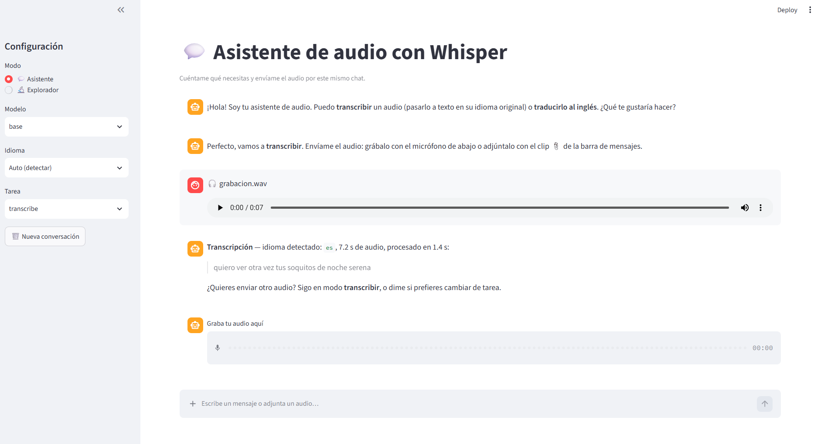

El asistente detectó el español, procesó 7,2 s de audio en 1,4 s y devolvió el texto en el mismo idioma. Después mantuvo la tarea activa y dejó listo el grabador para el siguiente audio.

**Prueba 2 · Traducción al inglés.** Se eligió la tarea "Traducir al inglés"; el asistente advirtió que Whisper traduce únicamente hacia el inglés y se grabó un mensaje corto en español.

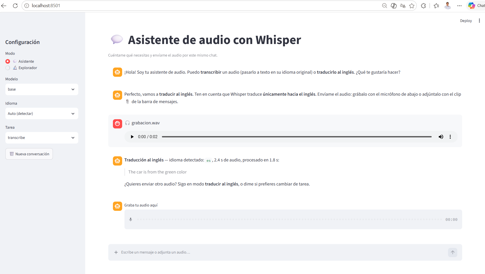

El asistente detectó el español en 2,4 s de audio y devolvió la traducción al inglés en 1,8 s. La frase obtenida, *"The car is from the green color"*, se acerca más a una formulación literal que a una expresión natural en inglés, como "The car is green". En la prueba realizada, la traducción obtenida fue comprensible, aunque presentó una formulación literal respecto a una expresión más natural en inglés.

### 6.2 Prueba en el modo Explorador

Se grabó la frase *"¿Dónde está Felipe?"* (2,58 s) y se analizó el recorrido completo por el modelo.

**Entradas.** El audio se remuestrea a 16 000 Hz y se convierte en un espectrograma Mel de 80 × 3000:

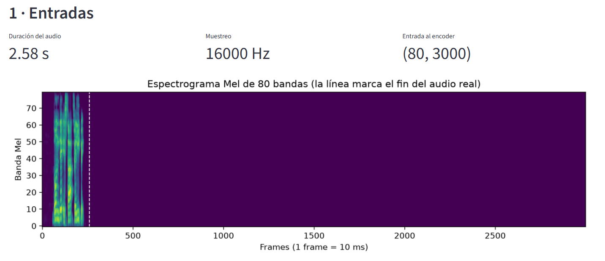

El habla ocupa solo los frames entre 60 y 230 aproximadamente (de 0,6 s a 2,3 s). La línea punteada marca el fin del audio real; todo lo que está a la derecha es el relleno de silencio que completa la ventana fija de 30 s. En este caso, más del 90 % de la entrada al encoder es silencio.

**Salidas.**

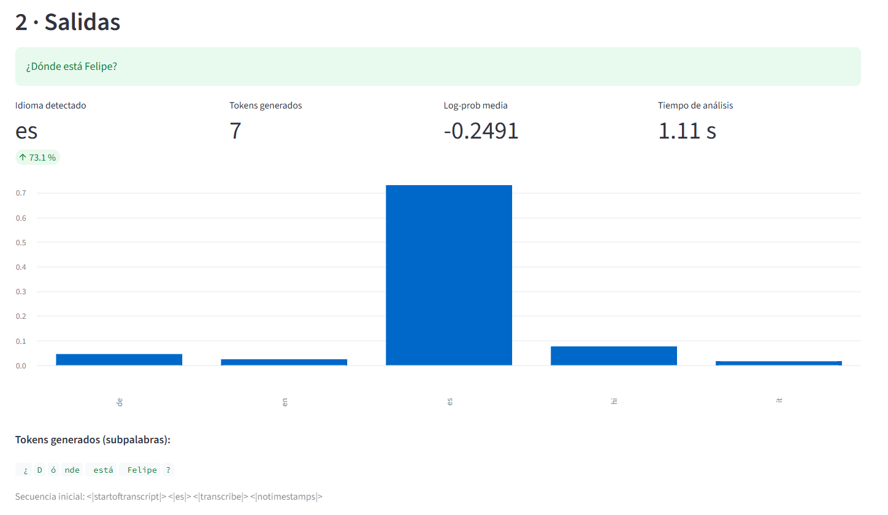

El modelo detectó el español con una probabilidad del 73,1 %. Los siguientes idiomas fueron hindi (cerca del 8 %) y alemán (cerca del 5 %). En esta prueba, con un audio de 2,58 s, la probabilidad asignada al español fue moderada.

La secuencia inicial `<|startoftranscript|> <|es|> <|transcribe|> <|notimestamps|>` confirma el formato multitarea: el idioma y la tarea se le indican al decoder con tokens especiales. El decoder generó 7 subpalabras: `¿` `D` `ó` `nde` `está` `Felipe` `?`. La palabra "Dónde" se dividió en tres tokens (`D`, `ó` y `nde`).

**Confianza por token.**

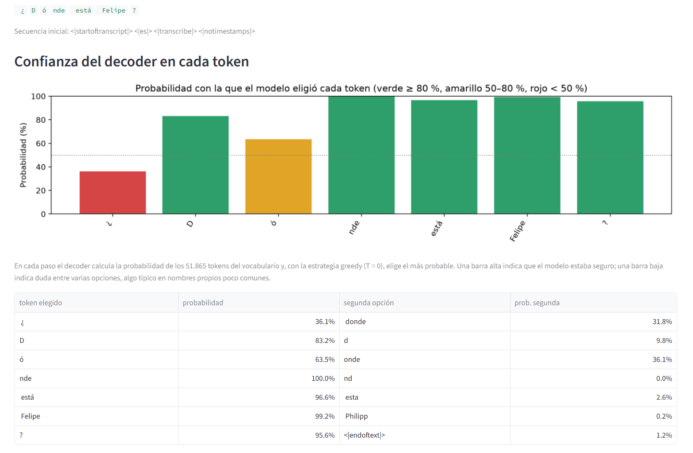

| Token elegido | Probabilidad | Segunda opción | Prob. segunda |
|---|---|---|---|
| ¿ | 36,1 % | donde | 31,8 % |
| D | 83,2 % | d | 9,8 % |
| ó | 63,5 % | onde | 36,1 % |
| nde | 100,0 % | nd | 0,0 % |
| está | 96,6 % | esta | 2,6 % |
| Felipe | 99,2 % | Philipp | 0,2 % |
| ? | 95,6 % | `<\|endoftext\|>` | 1,2 % |

La menor confianza se presenta en los primeros tokens. En el primer token existe una competencia cercana entre iniciar con el signo de interrogación (36,1 %) o comenzar directamente con "donde" (31,8 %). En el tercer token hay competencia entre "ó" con tilde y "onde" sin tilde (63,5 % frente a 36,1 %), es decir, entre escribir la palabra con o sin acento. Una vez definida la palabra "Dónde", el resto de la frase se genera con confianza superior al 95 %. El nombre propio "Felipe" fue reconocido con una probabilidad del 99,2 %, mientras que "Philipp" apareció como segunda opción con 0,2 %. La log-probabilidad media de −0,25 resume una transcripción con buena seguridad general.

**Interpretación de Q, K y V y atención cruzada.**

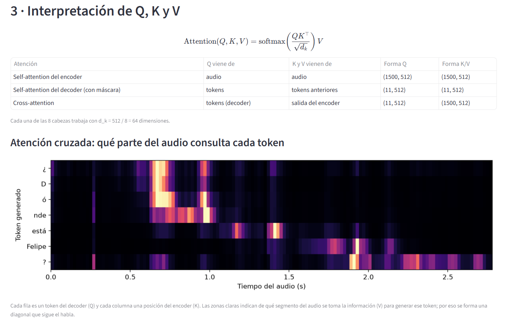

La tabla muestra las formas reales de los tensores en esta prueba. En la self-attention del encoder, Q, K y V provienen del audio y tienen forma (1500, 512). En el decoder, la forma es (11, 512) porque la secuencia tiene 11 tokens: los 4 especiales de inicio más los 7 generados. En la cross-attention, Q tiene forma (11, 512) porque viene del decoder, mientras que K y V tienen forma (1500, 512) porque vienen del encoder. Esto confirma que la consulta proviene del texto y la información consultada, del audio.

La visualización de la atención cruzada permite observar la relación entre los tokens generados y distintas regiones temporales del audio durante la inferencia. En esta prueba, las zonas de mayor peso siguen un orden aproximadamente diagonal:

- `¿`, `D`, `ó` y `nde` atienden al tramo de 0,6 s a 1,0 s, donde se pronuncia "dónde".
- `está` atiende principalmente al tramo de 1,2 s a 1,45 s.
- `Felipe` atiende al tramo de 1,75 s a 2,0 s.
- `?` presenta sus mayores pesos en el tramo final del habla (cerca de 1,9 s a 2,3 s) y una atención más repartida sobre el resto del audio.

Los pesos mostrados corresponden al promedio de las cabezas y de la mitad superior de las capas del decoder, por lo que la visualización resume el comportamiento de varias cabezas y no el de una sola.

### 6.3 Métricas de desempeño

Para medir la velocidad se usa el **RTF (Real-Time Factor)**, definido como el tiempo de procesamiento dividido entre la duración del audio. Un RTF menor que 1 indica que el audio se procesa más rápido que su duración real.

| Prueba | Modo | Tarea | Duración | Idioma detectado | Tiempo de proceso | RTF |
|---|---|---|---|---|---|---|
| 1 | Asistente | Transcribir | 7,2 s | es | 1,4 s | 0,19 |
| 2 | Asistente | Traducir al inglés | 2,4 s | es | 1,8 s | 0,75 |
| 3 | Explorador | Transcribir | 2,58 s | es (73,1 %) | 1,11 s | 0,43 |

En la prueba 3 se obtuvieron además 7 tokens generados y una log-probabilidad media de −0,2491.

**Análisis.**

- **Velocidad.** En las tres pruebas el RTF fue menor que 1, es decir, el audio se procesó más rápido que su duración, incluso en CPU. El RTF más bajo se obtuvo con el audio más largo (0,19 con 7,2 s). Una posible explicación es que el encoder siempre procesa una ventana completa de 30 s, por lo que parte del costo no depende de la duración del habla; sin embargo, con tres pruebas, que además usan rutas de inferencia distintas (`transcribe()` en el Asistente y el bucle manual en el Explorador), no es posible generalizar esta tendencia.
- **Detección de idioma.** El español se detectó correctamente en las tres pruebas. En la prueba 3, la probabilidad asignada al español fue de 73,1 %.
- **Calidad.** La transcripción del Explorador fue exacta, con signos de interrogación y tilde incluidos. La traducción fue comprensible, aunque con una formulación literal.
- **Transcripción frente a traducción.** Las dos tareas usan exactamente el mismo modelo y los mismos pesos; lo único que cambia es el token `<|transcribe|>` o `<|translate|>` al inicio de la secuencia del decoder.

---

## 7. Conclusiones

### Aprendizajes

- La visualización de la atención cruzada permitió observar la relación entre los tokens generados y distintas regiones temporales del audio durante la inferencia.
- La confianza por token permitió identificar en qué tokens hubo mayor competencia entre alternativas; en la prueba realizada, en los primeros tokens de la frase.
- La atención cruzada es el puente entre las dos modalidades: Q viene del texto y K y V vienen del audio, y su mapa de pesos muestra de forma directa cómo el modelo alinea ambas secuencias.
- La división en tokens especiales permite que un mismo Transformer resuelva varias tareas solo con cambiar el inicio de la secuencia.
- Implementar la decodificación manualmente, en lugar de usar `transcribe()`, permitió entender que la salida se genera token por token y que el encoder se ejecuta una sola vez.

### Limitaciones

- **Ventana fija de 30 segundos.** El Explorador analiza solo los primeros 30 s del audio; el Asistente sí procesa audios largos dividiéndolos en ventanas.
- **Traducción solo hacia el inglés.**
- **Decodificación greedy.** Sin *beam search* ni ajuste de temperatura, el modelo puede repetir frases o generar texto que no está en el audio (alucinaciones), sobre todo con silencios largos.
- **Sin caché de K y V en el bucle manual.** Cada paso recalcula toda la secuencia, lo que hace la inferencia más lenta que la implementación oficial.
- **Alcance de las pruebas.** Los resultados provienen de tres audios cortos en español, por lo que no permiten generalizar el desempeño del modelo a otros idiomas, acentos, duraciones o condiciones de ruido.

### Posibles mejoras

- Usar las `alignment_heads` del modelo para obtener mapas de atención cruzada más precisos.
- Visualizar también la self-attention del encoder y la máscara causal del decoder.
- Implementar caché de K y V y *beam search*.
- Procesar audios largos en el Explorador con ventanas deslizantes.
- Ajustar el modelo (*fine-tuning*) con vocabulario propio del dominio.

---

## 8. Referencias

[1] A. Radford, J. W. Kim, T. Xu, G. Brockman, C. McLeavey e I. Sutskever, "Robust speech recognition via large-scale weak supervision," en *Proc. 40th Int. Conf. Machine Learning (ICML)*, Honolulu, HI, EE. UU., 2023, pp. 28492–28518.

[2] OpenAI, "Whisper," repositorio de GitHub, 2022. [En línea]. Disponible: https://github.com/openai/whisper

[3] A. Vaswani, N. Shazeer, N. Parmar, J. Uszkoreit, L. Jones, A. N. Gomez, Ł. Kaiser e I. Polosukhin, "Attention is all you need," en *Advances in Neural Information Processing Systems 30 (NeurIPS)*, Long Beach, CA, EE. UU., 2017, pp. 5998–6008.

[4] Streamlit Inc., "Streamlit documentation," 2026. [En línea]. Disponible: https://docs.streamlit.io

[5] A. Paszke *et al.*, "PyTorch: An imperative style, high-performance deep learning library," en *Advances in Neural Information Processing Systems 32 (NeurIPS)*, Vancouver, Canadá, 2019, pp. 8024–8035.
